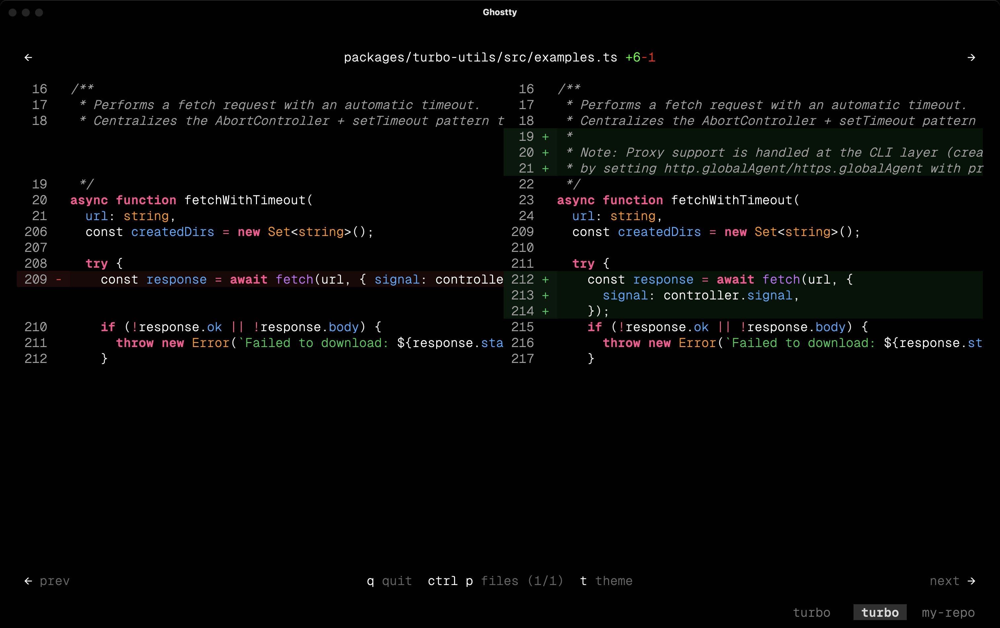

# critique

A beautiful terminal UI for reviewing git diffs with syntax highlighting, split view, and word-level diff.



## Installation

> **Note:** critique requires [Bun](https://bun.sh) - it does not work with Node.js.

```bash
# Run directly with bunx (no install needed)
bunx critique

# Or install globally
bun install -g critique
```

## Usage

### View Git Diff

```bash
# View unstaged changes (includes untracked files)
critique

# View staged changes
critique --staged

# View the last commit (works whether pushed or unpushed)
critique HEAD

# View a specific commit
critique --commit HEAD~1
critique abc1234

# View combined changes from last N commits
critique HEAD~3 HEAD    # shows all changes from 3 commits ago to now

# Compare two branches (PR-style, shows what head added since diverging from base)
critique main feature-branch    # what feature-branch added vs main
critique main HEAD              # what current branch added vs main

# Watch mode - auto-refresh on file changes
critique --watch

# Filter files by glob pattern (can be used multiple times)
critique --filter "src/**/*.ts"
critique --filter "src/**/*.ts" --filter "lib/**/*.js"
```

### Navigation

| Key | Action |
|-----|--------|
| `←` / `→` | Navigate between files |
| `↑` / `↓` | Scroll up/down |
| `Ctrl+P` | Open file selector dropdown |
| `Option` (hold) | Fast scroll (10x) |
| `Esc` | Close dropdown |

### Git Difftool Integration

Configure critique as your git difftool:

```bash
git config --global diff.tool critique
git config --global difftool.critique.cmd 'critique difftool "$LOCAL" "$REMOTE"'
```

Then use:

```bash
git difftool HEAD~1
```

### AI-Powered Review

Get AI-powered code review of your changes using [OpenCode](https://opencode.ai) or [Claude Code](https://www.anthropic.com/claude-code) as the backend agent.

```bash
# Review unstaged changes (uses OpenCode by default)
critique review

# Use Claude Code instead
critique review --agent claude

# Review staged changes
critique review --staged

# Review a specific commit
critique review --commit HEAD
critique review --commit abc1234

# Review commit range (like a PR)
critique review main HEAD

# Include session context
critique review --session <session-id>

# Generate web preview instead of TUI
critique review --web
critique review --web --open
```

**Options:**

| Flag | Description |
|------|-------------|
| `--agent <name>` | AI agent to use: `opencode` (default) or `claude` |
| `--staged` | Review staged changes |
| `--commit <ref>` | Review changes from a specific commit |
| `--session <id>` | Include session(s) as context (can be repeated) |
| `--web` | Generate web preview instead of TUI |
| `--open` | Open web preview in browser (with --web) |
| `--filter <pattern>` | Filter files by glob pattern |

### Pick Files from Another Branch

Selectively apply changes from another branch to your current HEAD:

```bash
critique pick feature-branch
```

Use the interactive UI to select files. Selected files are immediately applied as patches, deselected files are restored.

### Web Preview

Generate a shareable web preview of your diff that you can send to anyone - no installation required.

**Example:** [critique.work/v/b8faf4362c247bfc46f5098a028e00f0](https://critique.work/v/b8faf4362c247bfc46f5098a028e00f0)

Great for background agents that can't render terminal UIs, like [kimaki.xyz](https://kimaki.xyz) which runs OpenCode in Discord.


```bash
# Upload to critique.work and get a shareable URL
critique web

# View staged changes
critique web --staged

# View the last commit
critique web HEAD

# View a specific commit
critique web --commit HEAD~1

# Compare branches (PR-style diff)
critique web main feature-branch

# Filter specific files
critique web -- src/api.ts src/utils.ts

# Custom title for the HTML page
critique web --title "Fix authentication bug"

# Generate local HTML file instead of uploading
critique web --local
```

**Features:**

- **Mobile optimized** - Automatically detects mobile devices and serves a unified diff view optimized for smaller screens. Add `?v=mobile` to any URL to force mobile view.
- **Dark/Light mode** - Automatically adapts to your system's color scheme preference using CSS `prefers-color-scheme`.
- **Syntax highlighting** - Full syntax highlighting for 18+ languages, same as the terminal UI.
- **Split view** - Side-by-side diff on desktop, unified view on mobile.
- **Fast loading** - HTML is streamed for quick initial render, cached for 24 hours.

**Options:**

| Flag | Description | Default |
|------|-------------|---------|
| `--staged` | Show staged changes | - |
| `--commit <ref>` | Show changes from a specific commit | - |
| `--cols <n>` | Terminal width for rendering | `240` |
| `--mobile-cols <n>` | Terminal width for mobile version | `100` |
| `--local` | Save HTML locally instead of uploading | - |
| `--filter <pattern>` | Filter files by glob (can be used multiple times) | - |
| `--title <text>` | Custom HTML document title | `Critique Diff` |
| `--theme <name>` | Theme for rendering (disables auto dark/light mode) | - |

**How it works:**

1. Captures the terminal UI output using a PTY (pseudo-terminal)
2. Converts ANSI escape codes to styled HTML with syntax highlighting
3. Generates both desktop (240 cols, split view) and mobile (100 cols, unified view) versions
4. Uploads to [critique.work](https://critique.work) (Cloudflare Worker + KV storage)
5. Returns a shareable URL that expires after 7 days

**Tips:**

- The URL is based on a SHA-256 hash of the content, so identical diffs produce the same URL (deduplication)
- Use `?v=desktop` or `?v=mobile` query params to force a specific version
- If upload fails, critique automatically saves the HTML locally as a fallback

## Features

- **Syntax Highlighting** - Powered by [Shiki](https://shiki.style/) with support for 18+ languages
- **Split View** - Side-by-side comparison for wide terminals (auto-switches to unified view on narrow terminals)
- **Word-Level Diff** - Highlights specific word changes within modified lines
- **File Navigation** - Quick file switcher with fuzzy search
- **Click to Open** - Click line numbers to open in your editor (set `REACT_EDITOR` env var)
- **Watch Mode** - Live updates as you edit files
- **Web Preview** - Generate shareable HTML previews hosted on [critique.work](https://critique.work)
- **Cherry Pick** - Interactive file picker to apply changes from other branches

## Supported Languages

TypeScript, JavaScript, TSX, JSX, JSON, Markdown, HTML, CSS, Python, Rust, Go, Java, C, C++, YAML, TOML, Bash, SQL

## Configuration

| Environment Variable | Description | Default |
|---------------------|-------------|---------|
| `REACT_EDITOR` | Editor command for click-to-open | `zed` |
| `CRITIQUE_WORKER_URL` | Custom worker URL for web preview | `https://critique.work` |

## Ignored Files

Lock files are automatically hidden from diffs:
- `pnpm-lock.yaml`
- `package-lock.json`
- `yarn.lock`
- `bun.lockb`
- `Cargo.lock`
- `poetry.lock`
- `Gemfile.lock`
- `composer.lock`

Files with more than 6000 lines of diff are also hidden for performance.

## Built With

- [opentui](https://github.com/sst/opentui) - React-based terminal UI framework
- [Shiki](https://shiki.style/) - Syntax highlighting
- [diff](https://github.com/kpdecker/jsdiff) - Diff algorithm
- [Hono](https://hono.dev/) - Web framework for the preview worker

## License

MIT
